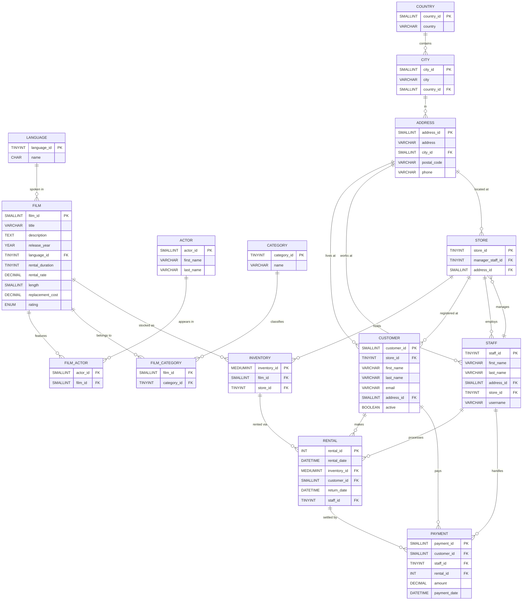

Sakila Database — Schema Overview

> A comprehensive reference for the Sakila sample database, covering all 16 tables, their columns, relationships, and an entity-relationship diagram.

---

## Table of Contents

1. [Overview](#overview)
2. [Entity-Relationship Diagram](#entity-relationship-diagram)
3. [Core Domain: Film Catalog](#core-domain-film-catalog)
4. [Core Domain: Inventory & Store](#core-domain-inventory--store)
5. [Core Domain: Customers & Rentals](#core-domain-customers--rentals)
6. [Core Domain: Staff & Payments](#core-domain-staff--payments)
7. [Supporting Tables](#supporting-tables)
8. [Key Relationships Summary](#key-relationships-summary)

---

## Overview

The **Sakila** database models a DVD rental business. It was originally developed by MySQL AB as a sample schema demonstrating real-world relational design patterns. The schema contains **16 tables**, **7 views**, and several stored procedures and functions.

The data flows naturally through three main lifecycles:

```
Film Catalog → Inventory → Rental → Payment
```

---

## Entity-Relationship Diagram



---

## Core Domain: Film Catalog

### `film`
The central catalog table. Every rental traces back to a film.

| Column | Type | Notes |
|---|---|---|
| `film_id` | SMALLINT UNSIGNED | Primary key |
| `title` | VARCHAR(255) | Film title |
| `description` | TEXT | Plot summary |
| `release_year` | YEAR | Year of release |
| `language_id` | TINYINT UNSIGNED | FK → `language` |
| `original_language_id` | TINYINT UNSIGNED | FK → `language` (nullable) |
| `rental_duration` | TINYINT UNSIGNED | Default rental period in days |
| `rental_rate` | DECIMAL(4,2) | Cost per rental |
| `length` | SMALLINT UNSIGNED | Runtime in minutes |
| `replacement_cost` | DECIMAL(5,2) | Cost if not returned |
| `rating` | ENUM | G, PG, PG-13, R, NC-17 |
| `special_features` | SET | Trailers, Commentaries, etc. |
| `last_update` | TIMESTAMP | Auto-managed |

---

### `actor`
Performers who appear in films.

| Column | Type | Notes |
|---|---|---|
| `actor_id` | SMALLINT UNSIGNED | Primary key |
| `first_name` | VARCHAR(45) | |
| `last_name` | VARCHAR(45) | Indexed |
| `last_update` | TIMESTAMP | |

---

### `film_actor`
Many-to-many join between films and actors.

| Column | Type | Notes |
|---|---|---|
| `actor_id` | SMALLINT UNSIGNED | FK → `actor`, composite PK |
| `film_id` | SMALLINT UNSIGNED | FK → `film`, composite PK |
| `last_update` | TIMESTAMP | |

---

### `category`
Genre/category labels for films.

| Column | Type | Notes |
|---|---|---|
| `category_id` | TINYINT UNSIGNED | Primary key |
| `name` | VARCHAR(25) | e.g. Action, Comedy, Horror |
| `last_update` | TIMESTAMP | |

---

### `film_category`
Many-to-many join between films and categories.

| Column | Type | Notes |
|---|---|---|
| `film_id` | SMALLINT UNSIGNED | FK → `film`, composite PK |
| `category_id` | TINYINT UNSIGNED | FK → `category`, composite PK |
| `last_update` | TIMESTAMP | |

---

### `language`
Languages used for film audio (original or dubbed).

| Column | Type | Notes |
|---|---|---|
| `language_id` | TINYINT UNSIGNED | Primary key |
| `name` | CHAR(20) | e.g. English, Italian |
| `last_update` | TIMESTAMP | |

---

## Core Domain: Inventory & Store

### `inventory`
Each row represents one **physical copy** of a film at a specific store. A film may have multiple inventory rows across one or more stores.

| Column | Type | Notes |
|---|---|---|
| `inventory_id` | MEDIUMINT UNSIGNED | Primary key |
| `film_id` | SMALLINT UNSIGNED | FK → `film` |
| `store_id` | TINYINT UNSIGNED | FK → `store` |
| `last_update` | TIMESTAMP | |

> 💡 **Key insight**: To check if a film is available for rent, query `inventory` joined against `rental` — if no open rental exists for an inventory item, it's available.

---

### `store`
Physical store locations.

| Column | Type | Notes |
|---|---|---|
| `store_id` | TINYINT UNSIGNED | Primary key |
| `manager_staff_id` | TINYINT UNSIGNED | FK → `staff` |
| `address_id` | SMALLINT UNSIGNED | FK → `address` |
| `last_update` | TIMESTAMP | |

---

## Core Domain: Customers & Rentals

### `customer`
Registered customers who rent films.

| Column | Type | Notes |
|---|---|---|
| `customer_id` | SMALLINT UNSIGNED | Primary key |
| `store_id` | TINYINT UNSIGNED | FK → `store` (home store) |
| `first_name` | VARCHAR(45) | |
| `last_name` | VARCHAR(45) | Indexed |
| `email` | VARCHAR(50) | |
| `address_id` | SMALLINT UNSIGNED | FK → `address` |
| `active` | BOOLEAN | 1 = active, 0 = inactive |
| `create_date` | DATETIME | Account creation date |
| `last_update` | TIMESTAMP | |

---

### `rental`
Each row is a single rental transaction — one inventory item, one customer, one rental period.

| Column | Type | Notes |
|---|---|---|
| `rental_id` | INT | Primary key |
| `rental_date` | DATETIME | When item was checked out |
| `inventory_id` | MEDIUMINT UNSIGNED | FK → `inventory` |
| `customer_id` | SMALLINT UNSIGNED | FK → `customer` |
| `return_date` | DATETIME | NULL if not yet returned |
| `staff_id` | TINYINT UNSIGNED | FK → `staff` (who processed it) |
| `last_update` | TIMESTAMP | |

> 💡 **Key insight**: A `NULL` `return_date` means the item is currently rented out.

---

## Core Domain: Staff & Payments

### `staff`
Employees who process rentals and payments.

| Column | Type | Notes |
|---|---|---|
| `staff_id` | TINYINT UNSIGNED | Primary key |
| `first_name` | VARCHAR(45) | |
| `last_name` | VARCHAR(45) | |
| `address_id` | SMALLINT UNSIGNED | FK → `address` |
| `email` | VARCHAR(50) | |
| `store_id` | TINYINT UNSIGNED | FK → `store` |
| `active` | BOOLEAN | |
| `username` | VARCHAR(16) | Login username |
| `password` | VARCHAR(40) | SHA1-hashed |
| `picture` | BLOB | Optional profile photo |
| `last_update` | TIMESTAMP | |

---

### `payment`
Each payment record settles a rental transaction.

| Column | Type | Notes |
|---|---|---|
| `payment_id` | SMALLINT UNSIGNED | Primary key |
| `customer_id` | SMALLINT UNSIGNED | FK → `customer` |
| `staff_id` | TINYINT UNSIGNED | FK → `staff` |
| `rental_id` | INT | FK → `rental` |
| `amount` | DECIMAL(5,2) | Amount charged |
| `payment_date` | DATETIME | When payment was made |
| `last_update` | TIMESTAMP | |

---

## Supporting Tables

### `address`
Shared address table used by customers, staff, and stores.

| Column | Type | Notes |
|---|---|---|
| `address_id` | SMALLINT UNSIGNED | Primary key |
| `address` | VARCHAR(50) | Street address line 1 |
| `address2` | VARCHAR(50) | Optional line 2 |
| `district` | VARCHAR(20) | State/province/district |
| `city_id` | SMALLINT UNSIGNED | FK → `city` |
| `postal_code` | VARCHAR(10) | |
| `phone` | VARCHAR(20) | |
| `last_update` | TIMESTAMP | |

---

### `city`
Cities linked to countries.

| Column | Type | Notes |
|---|---|---|
| `city_id` | SMALLINT UNSIGNED | Primary key |
| `city` | VARCHAR(50) | City name |
| `country_id` | SMALLINT UNSIGNED | FK → `country` |
| `last_update` | TIMESTAMP | |

---

### `country`
Country reference list.

| Column | Type | Notes |
|---|---|---|
| `country_id` | SMALLINT UNSIGNED | Primary key |
| `country` | VARCHAR(50) | Country name |
| `last_update` | TIMESTAMP | |

---

## Key Relationships Summary

| Relationship | Tables Involved | Type |
|---|---|---|
| Film ↔ Actor | `film`, `film_actor`, `actor` | Many-to-Many |
| Film ↔ Category | `film`, `film_category`, `category` | Many-to-Many |
| Film → Language | `film`, `language` | Many-to-One |
| Film → Physical Copy | `film`, `inventory` | One-to-Many |
| Inventory → Store | `inventory`, `store` | Many-to-One |
| Inventory → Rental | `inventory`, `rental` | One-to-Many |
| Customer → Rental | `customer`, `rental` | One-to-Many |
| Rental → Payment | `rental`, `payment` | One-to-One |
| Staff → Store | `staff`, `store` | Many-to-One (circular with manager) |
| Address → Customer / Staff / Store | `address` | One-to-Many (shared) |
| City → Address | `city`, `address` | One-to-Many |
| Country → City | `country`, `city` | One-to-Many |

---

## Notable Design Patterns

- **Shared address table**: `address` is reused by `customer`, `staff`, and `store` — normalises location data across entity types.
- **Circular FK between `store` and `staff`**: `store.manager_staff_id` → `staff` and `staff.store_id` → `store`. This is an intentional design demonstrating how circular references can be handled (requires careful insert order or deferred constraints).
- **Availability via open rentals**: Film availability is derived, not stored. Join `inventory` → `rental` and filter for `return_date IS NULL` to find currently rented copies.
- **Soft deletes**: Both `customer.active` and `staff.active` use boolean flags rather than deleting rows, preserving referential integrity and history.

---

*Generated as a schema contribution for [Raheemdevlops/test_db](https://github.com/Raheemdevlops/test_db/tree/mybranch/sakila). Based on the canonical Sakila sample database schema.*
